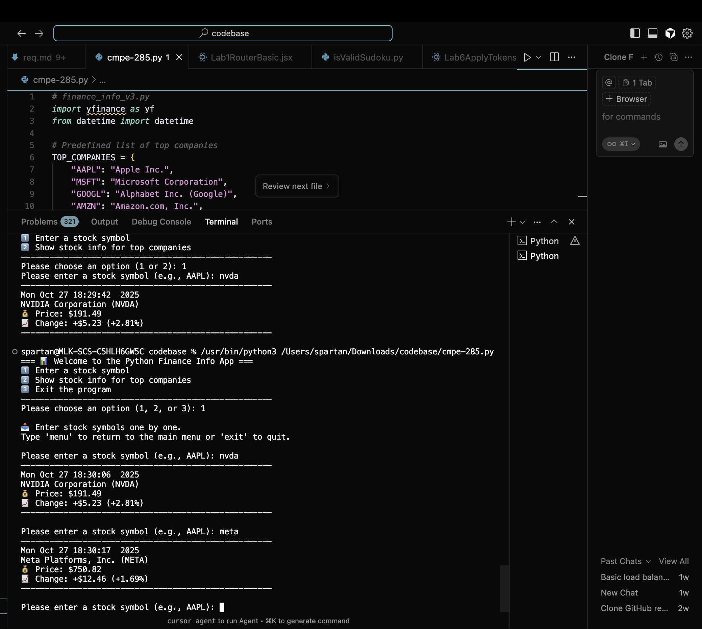

# 📊 Python Finance Info App

A Python-based command-line application that retrieves and displays real-time stock market data using the Yahoo Finance API.

## 📝 Assignment Description

This project was created as an individual homework assignment to practice Python networking programming. The program takes stock symbols as input and displays comprehensive financial information including current price, value changes, and percentage changes.

### Requirements Met:
- ✅ Takes stock symbol as input
- ✅ Displays current date and time
- ✅ Shows full company name
- ✅ Displays stock price
- ✅ Shows value changes (+ for increase, - for decrease)
- ✅ Shows percentage changes
- ✅ Handles error situations (network issues, invalid symbols)

## 🧠 What's New in This Version

| Feature | Description |
|---------|-------------|
| 🔁 Loop for continuous input | User can enter multiple stock symbols one after another without restarting |
| 🧭 Type "menu" | Returns to the main menu at any time |
| 🚪 Type "exit" | Exits the program gracefully |
| 🧩 Main menu loop | The program keeps running until the user chooses to exit |
| 🧹 Error-safe inputs | Handles empty or invalid inputs properly |
| 💅 Formatted output | Clear, structured, and easy-to-read terminal display |

## ✨ Features

- **Menu-Driven Interface**: Choose between entering custom symbols or viewing top companies
- **Real-Time Data**: Fetches live stock data using the `yfinance` API
- **Top Companies Quick View**: Pre-configured list of major tech companies (AAPL, MSFT, GOOGL, AMZN, META, TSLA, NVDA)
- **Continuous Input**: Enter multiple stock symbols without restarting the program
- **Error Handling**: Gracefully handles network errors, invalid symbols, and missing data
- **Formatted Output**: Clean, emoji-enhanced terminal display with clear separators

## 🚀 How to Run

### Prerequisites

1. **Python 3.x** installed on your system
2. **pip** package manager

### Installation

1. Clone this repository or download the files
2. Install required dependencies:

```bash
pip install yfinance
```

Or using a requirements file:

```bash
pip install -r requirements.txt
```

### Running the Program

```bash
python cmpe-285.py
```

Or:

```bash
python3 cmpe-285.py
```

## 📖 Usage

When you run the program, you'll see a main menu with three options:

```
=== 📊 Welcome to the Python Finance Info App ===
1️⃣  Enter a stock symbol
2️⃣  Show stock info for top companies
3️⃣  Exit the program
```

### Option 1: Enter a Stock Symbol

Enter any valid stock ticker symbol (e.g., AAPL, NVDA, META). The program will display:
- Current date and time
- Full company name
- Current stock price
- Price change (value and percentage)

You can continue entering symbols, type `menu` to return to the main menu, or `exit` to quit.

### Option 2: View Top Companies

Automatically displays stock information for 7 major tech companies:
- Apple (AAPL)
- Microsoft (MSFT)
- Alphabet/Google (GOOGL)
- Amazon (AMZN)
- Meta/Facebook (META)
- Tesla (TSLA)
- NVIDIA (NVDA)

### Option 3: Exit

Gracefully exits the program.

## 📸 Example Output

```
Mon Oct 27 18:30:06 2025
NVIDIA Corporation (NVDA)
💰 Price: $191.49
📈 Change: +$5.23 (+2.81%)
```

### Program Demo Screenshot



*Full demonstration of the program in action showing multiple stock queries*

## 🛠️ Technical Details

- **API Used**: `yfinance` (Yahoo Finance API)
- **Real-Time Data**: Fetches live market data
- **Error Handling**: Comprehensive try-catch blocks for network and data issues
- **Input Validation**: Handles empty inputs, invalid symbols, and unexpected data

## 📦 Dependencies

```
yfinance
datetime (built-in)
```

## ✅ Summary

This program:
- ✔️ Uses a real API (`yfinance`)
- ✔️ Retrieves real-time financial data
- ✔️ Displays all required information
- ✔️ Handles errors gracefully
- ✔️ Provides a menu-driven interface
- ✔️ Produces clean, formatted output

---

**Course**: CMPE-285  
**Assignment**: Python Finance Info - Individual Homework  
**Date**: October 2025

